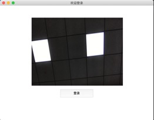
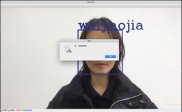

# FACE-LOGIN
## 简介
这是一个简单的人脸登录系统。通过摄像头采集人脸图像，判断是否允许登录  
## 关键技术
使用OpenCV人脸检测分类器Haar检测人脸  
使用LBPH识别器训练已知数据集及预测未知图片  
使用tkinter完成GUI  
## 运行环境
python: 3.7.4  
opencv-python： 4.1.2.30  
numpy：1.17.4  
## 效果图
【登录界面】  
  
【test】  
（1）用户不存在  
  
（2）未识别到人脸  
  
（3）登录成功  
  
【退出】  
  
## 训练集
将不同用户的正脸照片放在training_data/的不同的目录下，目录依次以0、1、2...命名  
不同用户对应的名字存储在face_recognition.py中  

73 # 表示人名与目录名的对应  
74 subjects = ["XuanBin", "LinZhiling"]  

